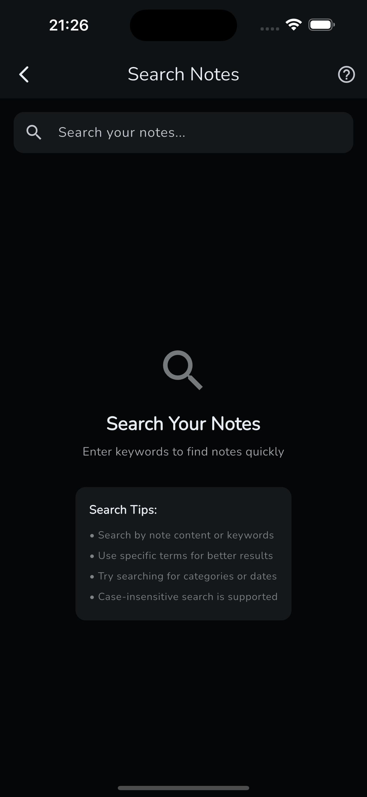
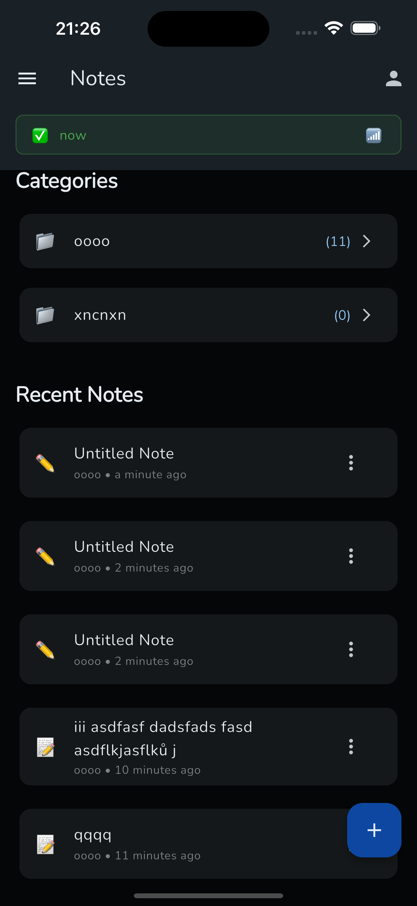
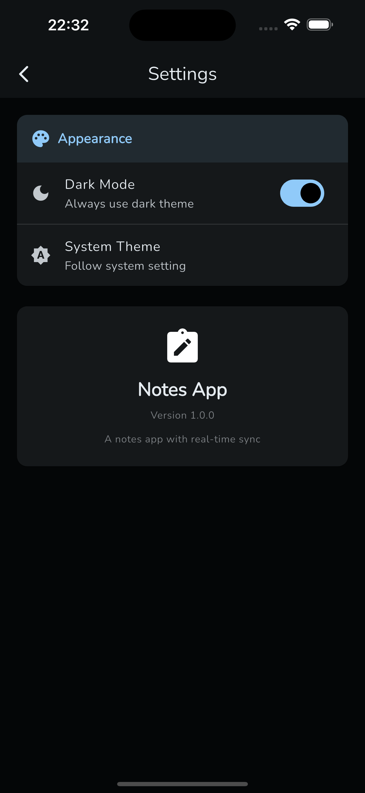
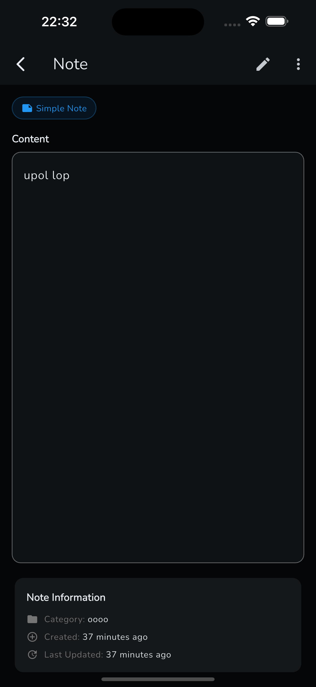
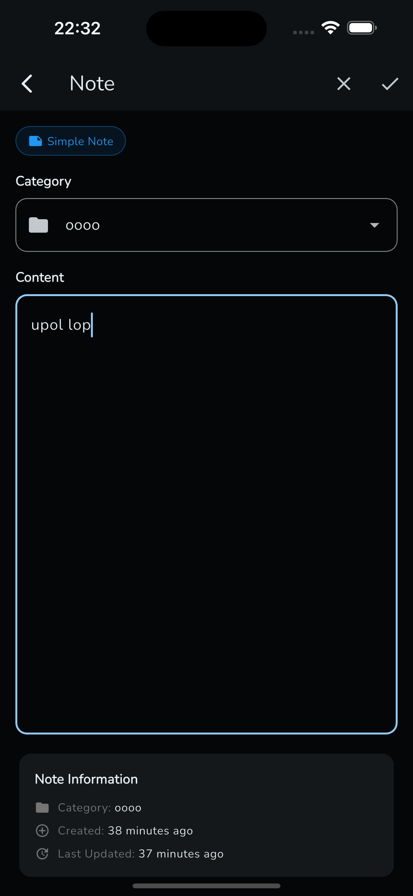

# Flutter Notes App with Real-time Sync

The goal was to test how claude code AI can help me build mobile apps on a simple example of Note taking app with synchronization of basic data and documents using CRDT.

## Project Structure

Clean architecture (no use-cases) with feature-based structure:

```
lib/
├── core/                    # Database, sync, auth
└── features/notes/          # Data, domain, presentation layers
```

## Tech Stack

### Core Libraries

- **State Management**: Riverpod for reactive state management
- **Database**: Drift (SQLite) with type-safe queries and migrations
- **Navigation**: Auto Route for declarative routing
- **UI**: Flutter Hooks for widget lifecycle management
- **Theming**: FlexColorScheme for Material Design 3 theming

### Synchronization

- Custom synchronization mechanism using generic coding and code generation
- Real-time document synchronization using CRDT (Conflict-free Replicated Data Types)
- Supabase backend with real-time subscriptions

## Architecture Experience

### What Worked Well with AI

The goal was to implement clean architecture (without use-cases) and make AI stick to that pattern. The AI successfully:

- **Database Layer**: Created well-structured Drift tables and database models
- **Domain Layer**: Properly implemented entities and repository contracts
- **Initial Architecture**: Followed clean architecture principles consistently at the start

### Challenges Encountered

However, problems emerged in the application/presentation layer where AI had difficulty following iterative improvement instructions:

- **Inconsistent Constants Usage**: Asked to use global constants throughout, but AI would only apply them sometimes
- **Code Duplication**: Created duplicate methods and widgets for the same functionality multiple times
- **Repetitive Code**: Would repeat the same code blocks even when only a small portion needed to change
- **Massive Files**: Initially created very large, monolithic files that were hard to maintain
- **Deep Callback Chains**: Generated complex nested callback structures that became difficult to follow

These issues would require significant refactoring time, making AI counterproductive for larger presentation layer tasks.

## My Development Practices (AI Struggled to Follow)

I tried to implement these practices throughout the project, but AI had difficulty maintaining consistency. I partially rewrote the home_page section to demonstrate these patterns, though AI made it messy again after iterations.

### Preferred Patterns:

- **Global Constants**: Using a central constants file for borderRadius, fontSize, spacings throughout the application
- **Consistent Styling**: Using the same styles throughout with BuildContext extensions and theme-based approaches
- **Widget Decomposition**: Splitting functionality into small, focused widgets
- **Proper Component Hierarchy**: Keeping components at the appropriate abstraction level where they're used
- **Feature-Based Organization**: Splitting code into clear feature boundaries

It is hard to propagate these changes to an existing AI generated files. This example focused on making the home_page and dialogues for notes feature into a correct shape. It improved a lot from the form that the AI made it, after many iterations with a hope of improving it. But still its not using constants thoughout.

## Architectural Experiments (What Didn't Work)

### Mixins for Provider Dependencies

I experimented with using mixins to combat the "spaghetti dependencies" that come from providers being somewhat global. However, this approach proved to be harder to maintain and change than traditional approaches.

**Better Approach**: Use providers at the leaf level to avoid passing many callbacks down the widget tree.

### Complex Dialog Patterns

The most problematic area was dialogs, which required extensive function passing. Bottom sheets needed internal consumers to rebuild when background data changes, creating complex dependency chains that were hard to manage.

## Showcase

The app demonstrates a clean, intuitive interface for note-taking with real-time synchronization capabilities:

<div align="center">
  
  
</div>

<div align="center">
  <p><em>Left: Search Page | Right: Home Page</em></p>
</div>

<div align="center">
  
  
  
</div>

<div align="center">
  <p><em>Left: Settings Page | Center: Note Page | Right: Simple Note Editing</em></p>
</div>

### Demo Video

Watch the app in action with real-time sync and CRDT-based document editing:

<div align="center">
  <video width="400" controls>
    <source src="screenrec1.mp4" type="video/mp4">
    Your browser does not support the video tag.
  </video>
</div>

### Key Features Demonstrated:

- **Category Management**: Organize notes into custom categories
- **Simple & Rich Notes**: Support for both plain text and rich document editing
- **Real-time Sync**: Changes propagate across devices instantly
- **Offline Support**: Works seamlessly without internet connection
- **CRDT Integration**: Conflict-free collaborative editing for rich documents

## Key Learnings & Recommendations

### For Future AI-Assisted Development:

1. **Establish Foundation First**: Create the basic project structure yourself with the coding style and patterns you want to maintain
2. **Let AI Analyze Your Style**: Have AI study your existing code and architecture before starting new features
3. **Create Focused Agents**: Develop specialized AI agents based on learned patterns for specific tasks
4. **Small, Incremental Tasks**: Give AI smaller, well-defined tasks rather than large feature implementations
5. **Focus on Non-Presentation Layers**: AI works best with database, domain, and business logic layers
6. **Keep a good quality "memory" files such ase CLAUDE.md**: Put there also a complete hierarchy of files so that it knows better where to look for files and thus combating the problems with duplicates and a bad structuring of the UI code.

### The Flutter Challenge

Flutter's ecosystem presents unique challenges for AI consistency:

- **Multiple State Management Solutions**: Riverpod, Bloc, Provider, etc. each have different patterns
- **Various UI Approaches**: Stateful/Stateless widgets, Hooks, functional approaches
- **Architecture Flexibility**: Clean Architecture, MVVM, MVC - many valid patterns exist

This diversity makes it difficult for AI to maintain consistency with specific requirements and coding styles, especially in complex presentation layers where personal preferences and team conventions matter most.

### Bottom Line

AI excels at foundational architecture and domain logic but struggles with maintaining consistent UI patterns and coding conventions across iterations. The key is leveraging AI's strengths while maintaining human oversight on what it produces.

## License

This project is created as part of a development exercise following Flutter best practices.
